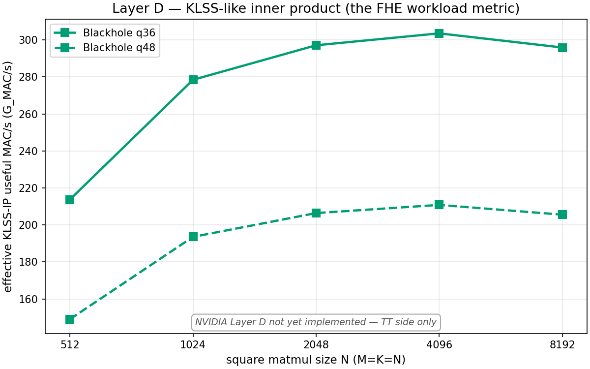
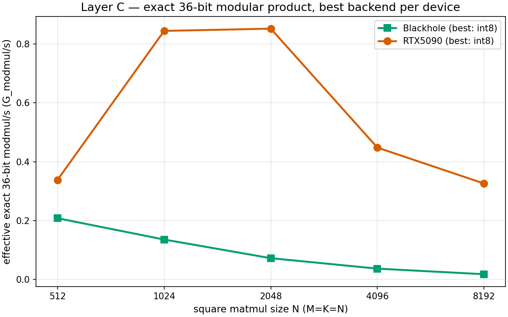
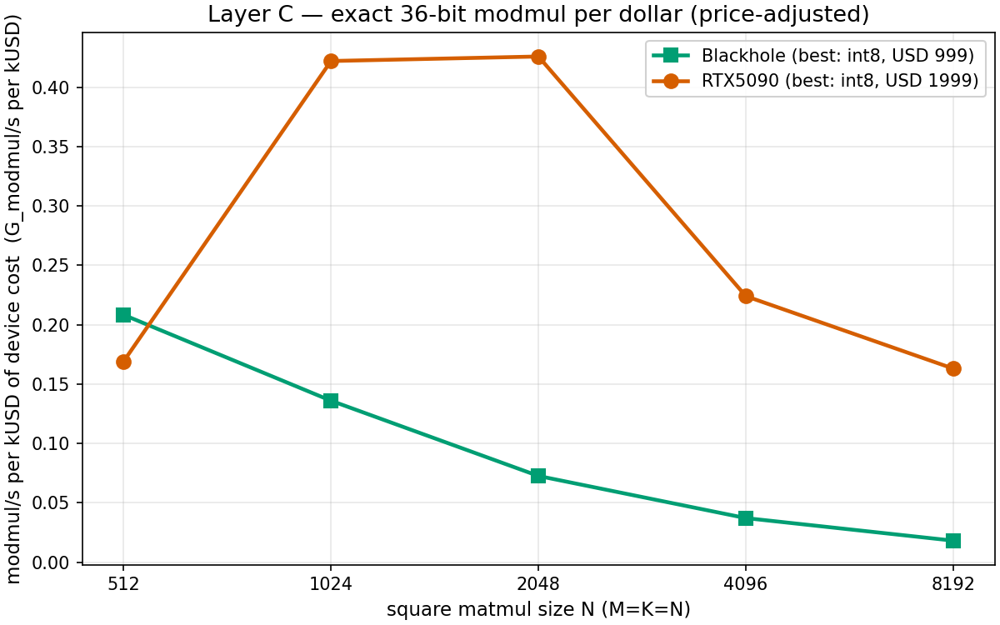
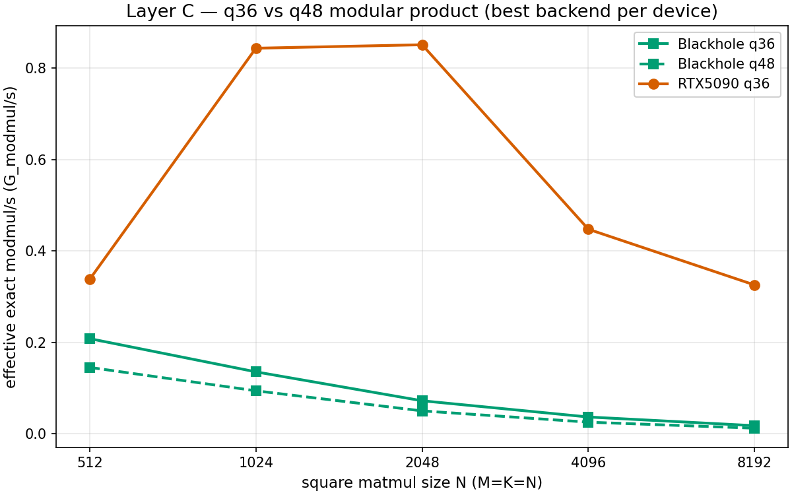
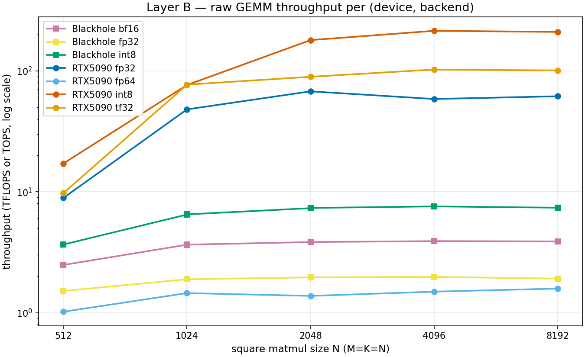
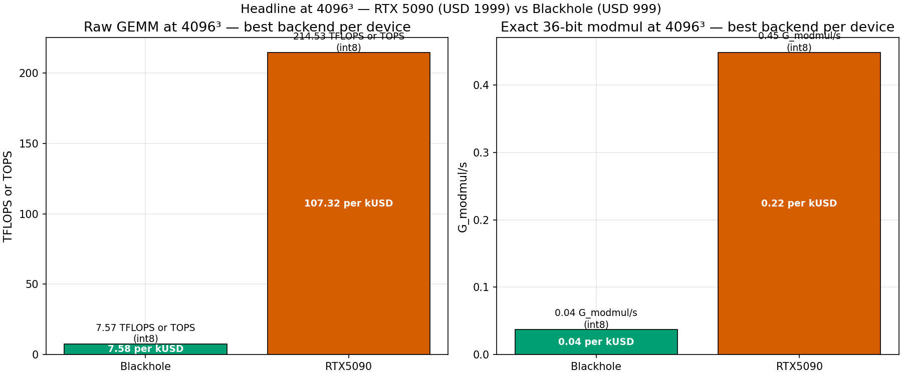

# Bench summary — RTX 5090 vs TT Blackhole

- **Schema versions present**: 1, 2
  _Mixed schemas merged. v2 is a strict superset of v1 (adds Layer D, q36/q48 op_kind variants, energy fields); v1 records have v2-only fields rendered as `—`._
- **Devices**: Blackhole, CPU, RTX5090
- **Records**: 283
- **Timestamps**: 2026-04-26T17:45:10+00:00 – 2026-04-28T00:35:03+00:00
- **Git SHAs**: 0682876, 75ccd37, 7e16b7d, 8c65d9d, da91d84, dbe3cc1, f6da9df, fa2e772

## Device prices (declared, not detected)

| device | price (USD) |
|---|---|
| Blackhole | 999 |
| CPU | (n/a) |
| RTX5090 | 1999 |

Update :data:`DEVICE_PRICES_USD` in `scripts/_bench_common.py` if these are stale.

## Plots

Generated by `scripts/plot_summary.py` from the same JSONL files as this summary. Re-run after each bench refresh.

### Layer D — KLSS-like inner product



_The actual FHE workload metric (useful MAC/s per second). Where TT KLSS results live._

### Layer C — exact 36-bit modmul throughput



_Best backend per device. q36 only; q48 is in a separate plot._

### Layer C — exact 36-bit modmul per dollar



_Same data, normalized by device MSRP. Answers the price-ratio question._

### Layer C — q36 vs q48 modular product



_Solid lines = q36, dashed = q48. Shows the cost of going to a 48-bit prime._

### Layer B — raw GEMM throughput



_Per (device, backend), log-y. Shows the full precision-vs-throughput envelope._

### Headline at 4096³



_Side-by-side bar chart at one representative shape._

## Layer A — capability probe
### Layer A

| op_kind | shape | backend | Blackhole thr | Blackhole /k$ | Blackhole W | Blackhole thr/W | Blackhole gate | RTX5090 thr | RTX5090 /k$ | RTX5090 W | RTX5090 thr/W | RTX5090 gate |
|---|---|---|---|---|---|---|---|---|---|---|---|---|
| gemm_mac | 1024×1024×1024 | bf16 | 3.65 TFLOPS | 3.656 /k$ | — | — | skipped | — | — | — | — | — |
| gemm_mac | 1024×1024×1024 | fp32 | — | — | — | — | skipped | 48.19 TFLOPS | 24.109 /k$ | — | — | skipped |
| gemm_mac | 1024×1024×1024 | fp64 | — | — | — | — | — | 1.49 TFLOPS | 0.747 /k$ | — | — | skipped |
| gemm_mac | 1024×1024×1024 | int8 | 6.49 TOPS | 6.492 /k$ | — | — | skipped | 76.35 TOPS | 38.193 /k$ | — | — | skipped |
| gemm_mac | 1024×1024×1024 | tf32 | 1.89 TFLOPS | 1.891 /k$ | — | — | skipped | 76.87 TFLOPS | 38.455 /k$ | — | — | skipped |

**Headline ratios — RTX5090 vs Blackhole, best backend per device** (higher = RTX5090 wins):

| op_kind | shape | RTX5090 best | Blackhole best | RTX5090 / Blackhole | price-adjusted (RTX5090 /k$) / (Blackhole /k$) |
|---|---|---|---|---|---|
| gemm_mac | 1024×1024×1024 | tf32 (76.87 TFLOPS) | int8 (6.49 TOPS) | 11.85× | 5.92× |

**Per-matching-backend ratios — RTX5090 vs Blackhole** (only shown where both devices have the backend implemented):

| op_kind | shape | backend | RTX5090 / Blackhole | price-adjusted (RTX5090 /k$) / (Blackhole /k$) |
|---|---|---|---|---|
| gemm_mac | 1024×1024×1024 | int8 | 11.77× | 5.88× |
| gemm_mac | 1024×1024×1024 | tf32 | 40.69× | 20.33× |

## Layer B — raw GEMM
### Layer B

| op_kind | shape | backend | Blackhole thr | Blackhole /k$ | Blackhole W | Blackhole thr/W | Blackhole gate | RTX5090 thr | RTX5090 /k$ | RTX5090 W | RTX5090 thr/W | RTX5090 gate |
|---|---|---|---|---|---|---|---|---|---|---|---|---|
| gemm_mac | 512×512×512 | bf16 | 2.49 TFLOPS | 2.491 /k$ | — | — | skipped | — | — | — | — | — |
| gemm_mac | 512×512×512 | fp32 | — | — | — | — | skipped | 8.90 TFLOPS | 4.450 /k$ | — | — | skipped |
| gemm_mac | 512×512×512 | fp64 | — | — | — | — | — | 1.02 TFLOPS | 0.510 /k$ | — | — | skipped |
| gemm_mac | 512×512×512 | int8 | 3.67 TOPS | 3.675 /k$ | — | — | skipped | 17.15 TOPS | 8.582 /k$ | — | — | skipped |
| gemm_mac | 512×512×512 | tf32 | 1.51 TFLOPS | 1.515 /k$ | — | — | skipped | 9.75 TFLOPS | 4.880 /k$ | — | — | skipped |
| gemm_mac | 640×704×704 | bf16_tuned_hifi2 | 59.30 TFLOPS | 59.359 /k$ | 39.5 W | 1.501 TFLOPS/W | skipped | — | — | — | — | — |
| gemm_mac | 640×704×704 | bf16_tuned_hifi4 | 51.31 TFLOPS | 51.361 /k$ | 39.5 W | 1.299 TFLOPS/W | skipped | — | — | — | — | — |
| gemm_mac | 640×704×704 | bf4_sanity | 23.15 TFLOPS | 23.173 /k$ | 39.5 W | 0.586 TFLOPS/W | skipped | — | — | — | — | — |
| gemm_mac | 640×704×704 | bf8_sanity | 24.12 TFLOPS | 24.144 /k$ | 39.5 W | 0.611 TFLOPS/W | skipped | — | — | — | — | — |
| gemm_mac | 640×1408×1408 | bf16_tuned_hifi2 | 124.58 TFLOPS | 124.705 /k$ | 39.5 W | 3.154 TFLOPS/W | skipped | — | — | — | — | — |
| gemm_mac | 640×1408×1408 | bf16_tuned_hifi4 | 97.56 TFLOPS | 97.658 /k$ | 39.5 W | 2.470 TFLOPS/W | skipped | — | — | — | — | — |
| gemm_mac | 640×1408×2816 | bf16_tuned_hifi2 | 149.62 TFLOPS | 149.770 /k$ | 39.5 W | 3.788 TFLOPS/W | skipped | — | — | — | — | — |
| gemm_mac | 640×1408×2816 | bf16_tuned_hifi4 | 106.53 TFLOPS | 106.637 /k$ | 39.5 W | 2.697 TFLOPS/W | skipped | — | — | — | — | — |
| gemm_mac | 1024×1024×1024 | bf16 | 3.66 TFLOPS | 3.661 /k$ | — | — | skipped | — | — | — | — | — |
| gemm_mac | 1024×1024×1024 | fp32 | — | — | — | — | skipped | 48.06 TFLOPS | 24.040 /k$ | — | — | skipped |
| gemm_mac | 1024×1024×1024 | fp64 | — | — | — | — | — | 1.45 TFLOPS | 0.727 /k$ | — | — | skipped |
| gemm_mac | 1024×1024×1024 | int8 | 6.49 TOPS | 6.492 /k$ | — | — | skipped | 76.43 TOPS | 38.236 /k$ | — | — | skipped |
| gemm_mac | 1024×1024×1024 | tf32 | 1.89 TFLOPS | 1.892 /k$ | — | — | skipped | 76.96 TFLOPS | 38.499 /k$ | — | — | skipped |
| gemm_mac | 1280×1408×1408 | bf16_tuned_hifi2 | 212.17 TFLOPS | 212.382 /k$ | 39.5 W | 5.371 TFLOPS/W | skipped | — | — | — | — | — |
| gemm_mac | 1280×1408×1408 | bf16_tuned_hifi4 | 111.71 TFLOPS | 111.822 /k$ | 39.5 W | 2.828 TFLOPS/W | skipped | — | — | — | — | — |
| gemm_mac | 1280×1408×2816 | bf16_tuned_hifi2 | 230.74 TFLOPS | 230.971 /k$ | 39.5 W | 5.842 TFLOPS/W | skipped | — | — | — | — | — |
| gemm_mac | 1280×1408×2816 | bf16_tuned_hifi4 | 117.93 TFLOPS | 118.048 /k$ | 39.5 W | 2.986 TFLOPS/W | skipped | — | — | — | — | — |
| gemm_mac | 1280×2816×2816 | bf16_tuned_hifi2 | 246.51 TFLOPS | 246.757 /k$ | 39.5 W | 6.241 TFLOPS/W | skipped | — | — | — | — | — |
| gemm_mac | 1280×2816×2816 | bf16_tuned_hifi4 | 123.75 TFLOPS | 123.874 /k$ | 39.5 W | 3.133 TFLOPS/W | skipped | — | — | — | — | — |
| gemm_mac | 2048×2048×2048 | bf16 | 3.85 TFLOPS | 3.850 /k$ | — | — | skipped | — | — | — | — | — |
| gemm_mac | 2048×2048×2048 | fp32 | — | — | — | — | skipped | 67.75 TFLOPS | 33.893 /k$ | — | — | skipped |
| gemm_mac | 2048×2048×2048 | fp64 | — | — | — | — | — | 1.38 TFLOPS | 0.689 /k$ | — | — | skipped |
| gemm_mac | 2048×2048×2048 | int8 | 7.36 TOPS | 7.363 /k$ | — | — | skipped | 179.74 TOPS | 89.913 /k$ | — | — | skipped |
| gemm_mac | 2048×2048×2048 | tf32 | 1.96 TFLOPS | 1.963 /k$ | — | — | skipped | 89.43 TFLOPS | 44.736 /k$ | — | — | skipped |
| gemm_mac | 2560×2816×2816 | bf16_tuned_hifi2 | 261.96 TFLOPS | 262.222 /k$ | 39.5 W | 6.632 TFLOPS/W | skipped | — | — | — | — | — |
| gemm_mac | 2560×2816×2816 | bf16_tuned_hifi4 | 130.39 TFLOPS | 130.521 /k$ | 39.5 W | 3.301 TFLOPS/W | skipped | — | — | — | — | — |
| gemm_mac | 2560×2816×4224 | bf16_tuned_hifi2 | 264.40 TFLOPS | 264.665 /k$ | 39.5 W | 6.694 TFLOPS/W | skipped | — | — | — | — | — |
| gemm_mac | 2560×2816×4224 | bf16_tuned_hifi4 | 134.68 TFLOPS | 134.815 /k$ | 39.5 W | 3.410 TFLOPS/W | skipped | — | — | — | — | — |
| gemm_mac | 2560×4224×4224 | bf16_tuned_hifi2 | 268.41 TFLOPS | 268.679 /k$ | 39.5 W | 6.795 TFLOPS/W | skipped | — | — | — | — | — |
| gemm_mac | 2560×4224×4224 | bf16_tuned_hifi4 | 141.34 TFLOPS | 141.481 /k$ | 39.5 W | 3.578 TFLOPS/W | skipped | — | — | — | — | — |
| gemm_mac | 3840×4224×4224 | bf16_tuned_hifi2 | 267.64 TFLOPS | 267.908 /k$ | 39.5 W | 6.776 TFLOPS/W | skipped | — | — | — | — | — |
| gemm_mac | 3840×4224×4224 | bf16_tuned_hifi4 | 142.24 TFLOPS | 142.382 /k$ | 39.5 W | 3.601 TFLOPS/W | skipped | — | — | — | — | — |
| gemm_mac | 3840×4224×5632 | bf16_tuned_hifi2 | 227.01 TFLOPS | 227.237 /k$ | 39.5 W | 5.747 TFLOPS/W | skipped | — | — | — | — | — |
| gemm_mac | 3840×4224×5632 | bf16_tuned_hifi4 | 131.19 TFLOPS | 131.321 /k$ | 39.5 W | 3.321 TFLOPS/W | skipped | — | — | — | — | — |
| gemm_mac | 3840×5632×5632 | bf16_tuned_hifi2 | 239.77 TFLOPS | 240.010 /k$ | 39.5 W | 6.070 TFLOPS/W | skipped | — | — | — | — | — |
| gemm_mac | 3840×5632×5632 | bf16_tuned_hifi4 | 134.96 TFLOPS | 135.095 /k$ | 39.5 W | 3.417 TFLOPS/W | skipped | — | — | — | — | — |
| gemm_mac | 4096×4096×4096 | bf16 | 3.91 TFLOPS | 3.916 /k$ | — | — | skipped | — | — | — | — | — |
| gemm_mac | 4096×4096×4096 | fp32 | — | — | — | — | skipped | 58.57 TFLOPS | 29.299 /k$ | — | — | skipped |
| gemm_mac | 4096×4096×4096 | fp64 | — | — | — | — | — | 1.49 TFLOPS | 0.747 /k$ | — | — | skipped |
| gemm_mac | 4096×4096×4096 | int8 | 7.57 TOPS | 7.582 /k$ | — | — | skipped | 214.53 TOPS | 107.321 /k$ | — | — | skipped |
| gemm_mac | 4096×4096×4096 | tf32 | 1.98 TFLOPS | 1.978 /k$ | — | — | skipped | 102.59 TFLOPS | 51.319 /k$ | — | — | skipped |
| gemm_mac | 4160×3520×3520 | bf16_tuned_hifi2 | 226.21 TFLOPS | 226.436 /k$ | 39.5 W | 5.727 TFLOPS/W | skipped | — | — | — | — | — |
| gemm_mac | 4160×3520×3520 | bf16_tuned_hifi4 | 134.78 TFLOPS | 134.915 /k$ | 39.5 W | 3.412 TFLOPS/W | skipped | — | — | — | — | — |
| gemm_mac | 5120×5632×5632 | bf16_tuned_hifi2 | 239.17 TFLOPS | 239.409 /k$ | 39.5 W | 6.055 TFLOPS/W | skipped | — | — | — | — | — |
| gemm_mac | 5120×5632×5632 | bf16_tuned_hifi4 | 136.01 TFLOPS | 136.146 /k$ | 39.5 W | 3.443 TFLOPS/W | skipped | — | — | — | — | — |
| gemm_mac | 8192×8192×8192 | bf16 | 3.89 TFLOPS | 3.892 /k$ | — | — | skipped | — | — | — | — | — |
| gemm_mac | 8192×8192×8192 | fp32 | — | — | — | — | skipped | 61.69 TFLOPS | 30.862 /k$ | — | — | skipped |
| gemm_mac | 8192×8192×8192 | fp64 | — | — | — | — | — | 1.58 TFLOPS | 0.792 /k$ | — | — | skipped |
| gemm_mac | 8192×8192×8192 | int8 | 7.39 TOPS | 7.402 /k$ | — | — | skipped | 210.11 TOPS | 105.105 /k$ | — | — | skipped |
| gemm_mac | 8192×8192×8192 | tf32 | 1.92 TFLOPS | 1.918 /k$ | — | — | skipped | 100.87 TFLOPS | 50.462 /k$ | — | — | skipped |
| gemm_mac | 10240×11264×11264 | bf16_tuned_hifi2 | 250.08 TFLOPS | 250.330 /k$ | 39.5 W | 6.331 TFLOPS/W | skipped | — | — | — | — | — |
| gemm_mac | 10240×11264×11264 | bf16_tuned_hifi4 | 131.28 TFLOPS | 131.411 /k$ | 39.5 W | 3.324 TFLOPS/W | skipped | — | — | — | — | — |
| gemm_mac | 20480×22528×22528 | bf16_tuned_hifi2 | 211.99 TFLOPS | 212.202 /k$ | 39.5 W | 5.367 TFLOPS/W | skipped | — | — | — | — | — |
| gemm_mac | 20480×22528×22528 | bf16_tuned_hifi4 | 122.70 TFLOPS | 122.823 /k$ | 39.5 W | 3.106 TFLOPS/W | skipped | — | — | — | — | — |

**Headline ratios — RTX5090 vs Blackhole, best backend per device** (higher = RTX5090 wins):

| op_kind | shape | RTX5090 best | Blackhole best | RTX5090 / Blackhole | price-adjusted (RTX5090 /k$) / (Blackhole /k$) |
|---|---|---|---|---|---|
| gemm_mac | 512×512×512 | int8 (17.15 TOPS) | int8 (3.67 TOPS) | 4.67× | 2.33× |
| gemm_mac | 1024×1024×1024 | tf32 (76.96 TFLOPS) | int8 (6.51 TOPS) | 11.83× | 5.91× |
| gemm_mac | 2048×2048×2048 | int8 (179.74 TOPS) | int8 (7.36 TOPS) | 24.44× | 12.21× |
| gemm_mac | 4096×4096×4096 | int8 (214.53 TOPS) | int8 (7.58 TOPS) | 28.31× | 14.15× |
| gemm_mac | 8192×8192×8192 | int8 (210.11 TOPS) | int8 (7.40 TOPS) | 28.39× | 14.19× |

**Per-matching-backend ratios — RTX5090 vs Blackhole** (only shown where both devices have the backend implemented):

| op_kind | shape | backend | RTX5090 / Blackhole | price-adjusted (RTX5090 /k$) / (Blackhole /k$) |
|---|---|---|---|---|
| gemm_mac | 512×512×512 | int8 | 4.67× | 2.33× |
| gemm_mac | 512×512×512 | tf32 | 6.45× | 3.22× |
| gemm_mac | 1024×1024×1024 | int8 | 11.78× | 5.89× |
| gemm_mac | 1024×1024×1024 | tf32 | 40.73× | 20.35× |
| gemm_mac | 2048×2048×2048 | int8 | 24.44× | 12.21× |
| gemm_mac | 2048×2048×2048 | tf32 | 45.61× | 22.79× |
| gemm_mac | 4096×4096×4096 | int8 | 28.32× | 14.15× |
| gemm_mac | 4096×4096×4096 | tf32 | 51.93× | 25.95× |
| gemm_mac | 8192×8192×8192 | int8 | 28.41× | 14.20× |
| gemm_mac | 8192×8192×8192 | tf32 | 52.65× | 26.31× |

## Layer C — exact modular product (q36, q48)
### Layer C

| op_kind | shape | backend | Blackhole thr | Blackhole /k$ | Blackhole W | Blackhole thr/W | Blackhole gate | CPU thr | CPU /k$ | CPU W | CPU thr/W | CPU gate | RTX5090 thr | RTX5090 /k$ | RTX5090 W | RTX5090 thr/W | RTX5090 gate |
|---|---|---|---|---|---|---|---|---|---|---|---|---|---|---|---|---|---|
| exact_modmul_q36 | 512×512×512 | bf16 | 0.12 G_modmul/s | 0.123 /k$ | — | — | passed | — | — | — | — | — | — | — | — | — | — |
| exact_modmul_q36 | 512×512×512 | int8 | 0.21 G_modmul/s | 0.208 /k$ | — | — | passed | — | — | — | — | — | 0.34 G_modmul/s | 0.169 /k$ | — | — | passed |
| exact_modmul_q36 | 1024×1024×1024 | bf16 | 0.07 G_modmul/s | 0.074 /k$ | — | — | passed | — | — | — | — | — | — | — | — | — | — |
| exact_modmul_q36 | 1024×1024×1024 | int8 | 0.14 G_modmul/s | 0.136 /k$ | — | — | passed | — | — | — | — | — | 0.84 G_modmul/s | 0.422 /k$ | — | — | passed |
| exact_modmul_q36 | 2048×2048×2048 | bf16 | 0.04 G_modmul/s | 0.038 /k$ | — | — | passed | — | — | — | — | — | — | — | — | — | — |
| exact_modmul_q36 | 2048×2048×2048 | int8 | 0.07 G_modmul/s | 0.073 /k$ | — | — | passed | — | — | — | — | — | 0.85 G_modmul/s | 0.426 /k$ | — | — | passed |
| exact_modmul_q36 | 4096×4096×4096 | bf16 | 0.02 G_modmul/s | 0.019 /k$ | — | — | passed | — | — | — | — | — | — | — | — | — | — |
| exact_modmul_q36 | 4096×4096×4096 | int8 | 0.04 G_modmul/s | 0.037 /k$ | — | — | passed | — | — | — | — | — | 0.45 G_modmul/s | 0.224 /k$ | — | — | passed |
| exact_modmul_q36 | 8192×8192×8192 | bf16 | 0.01 G_modmul/s | 0.010 /k$ | — | — | passed | — | — | — | — | — | — | — | — | — | — |
| exact_modmul_q36 | 8192×8192×8192 | int8 | 0.02 G_modmul/s | 0.018 /k$ | — | — | passed | — | — | — | — | — | 0.33 G_modmul/s | 0.163 /k$ | — | — | passed |
| exact_modmul_q36 | 100000×1×1 | cpu | — | — | — | — | — | 0.01 G_modmul/s | — | — | — | passed | — | — | — | — | — |
| exact_modmul_q48 | 512×512×512 | int8 | 0.15 G_modmul/s | 0.146 /k$ | — | — | passed | — | — | — | — | — | — | — | — | — | — |
| exact_modmul_q48 | 1024×1024×1024 | int8 | 0.09 G_modmul/s | 0.094 /k$ | — | — | passed | — | — | — | — | — | — | — | — | — | — |
| exact_modmul_q48 | 2048×2048×2048 | int8 | 0.05 G_modmul/s | 0.050 /k$ | — | — | passed | — | — | — | — | — | — | — | — | — | — |
| exact_modmul_q48 | 4096×4096×4096 | int8 | 0.03 G_modmul/s | 0.026 /k$ | — | — | passed | — | — | — | — | — | — | — | — | — | — |
| exact_modmul_q48 | 8192×8192×8192 | int8 | 0.01 G_modmul/s | 0.013 /k$ | — | — | passed | — | — | — | — | — | — | — | — | — | — |

**Headline ratios — RTX5090 vs Blackhole, best backend per device** (higher = RTX5090 wins):

| op_kind | shape | RTX5090 best | Blackhole best | RTX5090 / Blackhole | price-adjusted (RTX5090 /k$) / (Blackhole /k$) |
|---|---|---|---|---|---|
| exact_modmul | 512×512×512 | int8 (0.34 G_modmul/s) | int8 (0.21 G_modmul/s) | 1.62× | 0.81× |
| exact_modmul | 1024×1024×1024 | int8 (0.84 G_modmul/s) | int8 (0.14 G_modmul/s) | 6.21× | 3.10× |
| exact_modmul | 2048×2048×2048 | int8 (0.85 G_modmul/s) | int8 (0.07 G_modmul/s) | 11.74× | 5.87× |
| exact_modmul | 4096×4096×4096 | int8 (0.45 G_modmul/s) | int8 (0.04 G_modmul/s) | 12.09× | 6.04× |
| exact_modmul | 8192×8192×8192 | int8 (0.33 G_modmul/s) | int8 (0.02 G_modmul/s) | 18.04× | 9.01× |

**Per-matching-backend ratios — RTX5090 vs Blackhole** (only shown where both devices have the backend implemented):

| op_kind | shape | backend | RTX5090 / Blackhole | price-adjusted (RTX5090 /k$) / (Blackhole /k$) |
|---|---|---|---|---|
| exact_modmul | 512×512×512 | int8 | 1.62× | 0.81× |
| exact_modmul | 1024×1024×1024 | int8 | 6.21× | 3.10× |
| exact_modmul | 2048×2048×2048 | int8 | 11.74× | 5.87× |
| exact_modmul | 4096×4096×4096 | int8 | 12.09× | 6.04× |
| exact_modmul | 8192×8192×8192 | int8 | 18.04× | 9.01× |

## Layer D — KLSS-style inner product (useful MAC view)
### Layer D

| op_kind | shape | backend | Blackhole thr | Blackhole /k$ | Blackhole W | Blackhole thr/W | Blackhole gate |
|---|---|---|---|---|---|---|---|
| klss_ip_modmul_q36 | 512×512×512 | int8 | 213.70 G_MAC/s | 213.916 /k$ | 44.5 W | 4.802 G_MAC/s/W | passed |
| klss_ip_modmul_q36 | 1024×1024×1024 | int8 | 278.43 G_MAC/s | 278.710 /k$ | 44.5 W | 6.257 G_MAC/s/W | passed |
| klss_ip_modmul_q36 | 2048×2048×2048 | int8 | 297.10 G_MAC/s | 297.395 /k$ | 44.5 W | 6.676 G_MAC/s/W | passed |
| klss_ip_modmul_q36 | 4096×4096×4096 | int8 | 303.54 G_MAC/s | 303.842 /k$ | 44.5 W | 6.821 G_MAC/s/W | passed |
| klss_ip_modmul_q36 | 8192×8192×8192 | int8 | 295.89 G_MAC/s | 296.191 /k$ | 44.5 W | 6.649 G_MAC/s/W | passed |
| klss_ip_modmul_q48 | 512×512×512 | int8 | 149.03 G_MAC/s | 149.174 /k$ | 44.0 W | 3.387 G_MAC/s/W | passed |
| klss_ip_modmul_q48 | 1024×1024×1024 | int8 | 193.52 G_MAC/s | 193.717 /k$ | 44.5 W | 4.349 G_MAC/s/W | passed |
| klss_ip_modmul_q48 | 2048×2048×2048 | int8 | 206.39 G_MAC/s | 206.598 /k$ | 44.5 W | 4.638 G_MAC/s/W | passed |
| klss_ip_modmul_q48 | 4096×4096×4096 | int8 | 210.81 G_MAC/s | 211.020 /k$ | 45.0 W | 4.685 G_MAC/s/W | passed |
| klss_ip_modmul_q48 | 8192×8192×8192 | int8 | 205.53 G_MAC/s | 205.736 /k$ | 44.0 W | 4.671 G_MAC/s/W | passed |

## How to update

```
# NVIDIA host (this machine):
uv run --extra bench python scripts/bench_nvidia.py \
    --out bench-results/nvidia_$(git rev-parse --short HEAD).jsonl

# TT host (separate machine, see BENCHMARK_TT.md):
python tt-llk-skeleton/bench_blackhole.py \
    --out bench-results/blackhole_$(git rev-parse --short HEAD).jsonl

# Then back on this machine:
python scripts/compare.py bench-results/*.jsonl --out bench-results/SUMMARY.md
python scripts/plot_summary.py bench-results/*.jsonl --out-dir bench-results/
```
